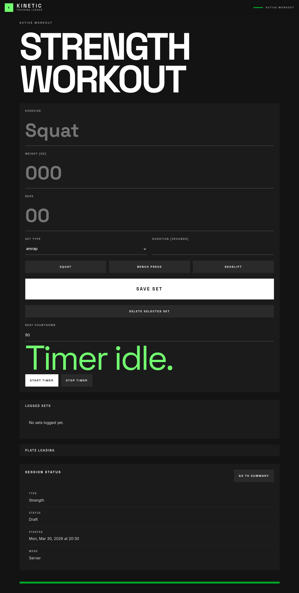

# Issue 9 Rearrange Workout Page

*2026-04-18T06:14:02Z by Showboat 0.6.1*
<!-- showboat-id: c6cf3c7d-1796-4522-9b6a-49177760b99b -->

## Issue

- Move `Session Status` to the bottom of the workout page.
- Hide `Duration (seconds)` unless a time-based set type is selected.
- Move quick prefill above `Save Set` and present the three buttons as equal-width actions.

## Fix

- Reordered the workout page so the set editor stays primary and the session status card sits below the secondary panels.
- Moved the quick prefill actions into the main form directly above `Save Set`.
- Added client-side set-type toggling so the duration field only appears for `amrap` and `for_time`, which preserves the existing backend validation for timed sets.

## How To Exercise

1. Open `/workouts/22222222-2222-4222-8222-222222222222`.
2. Confirm the quick prefill row sits above `Save Set`.
3. Confirm the duration field is hidden for `normal`, visible for `amrap`, and still visible for `for_time`.
4. Scroll down and confirm `Session Status` now appears below the logged-sets and plate-loading panels.

```bash {image}
screenshots/issue-9-rearrange-workout-page-default.png
```


```bash {image}
screenshots/issue-9-rearrange-workout-page-session-status.png
```



```bash {image}
screenshots/issue-9-rearrange-workout-page-amrap.png
```


