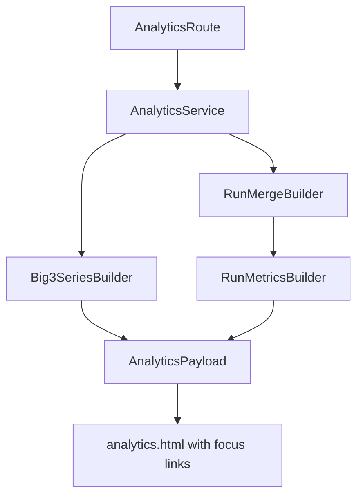

# Analytics Trend Expansion Plan

## Product direction: what is most interesting first

Implement in this priority order to maximize insight quickly:
- **Lift quality trend (Big 3):** top-set estimated 1RM by session + rolling 6-session average (cuts noise from backoff sets).
- **Lift workload trend (Big 3):** per-session volume (`sum(weight_kg * reps)`) and rep-intensity mix (`<=70%`, `70-85%`, `85%+` of session top set).
- **Run performance KPI:** current **5k equivalent PB** card on overview, with click-through to 3k/5k/10k equivalent trends.
- **Run intensity trend:** pace trend plus effort proxies (cal/min, optional HR zones when external data exists).
- **Consistency trend:** training frequency by week (lift-specific and run-specific) for context around PB jumps/drops.

## Scope and UX

- Keep a single page route: `GET /analytics`.
- Add query-param focus state in the same page:
  - `?focus=squat`
  - `?focus=bench_press`
  - `?focus=deadlift`
  - `?focus=run`
- Overview mode (no focus): cards + compact sparklines.
- Focus mode: detail panel below cards for selected metric with richer trend lists/charts.
- Make summary cards clickable links so no JS dependency is required for navigation state.

## Data model/query strategy

### 1) Big 3 detail model

In `app/analytics_service.py`, add per-lift builders returning:
- `latest_estimated_1rm`
- `estimated_1rm_points` (date/value)
- `estimated_1rm_rolling_avg_points` (window=6 sessions)
- `session_volume_points`
- `intensity_bucket_points` per session

Query source:
- `workout_sets` joined to `workouts`
- finalized workouts only
- exact lift names from existing `BIG3_NAMES`

### 2) Merged run dataset (requested option c)

Create one normalized run stream (sorted by `started_at`) by merging:
- **manual runs:** `workouts` where `type='run' AND status='finalized'`
- **external linked runs:** `external_activities` rows compatible with running and `status='linked'`

Deduplication rule:
- Prefer external row when a run workout is linked via `external_activities.linked_workout_id`.
- Keep standalone manual runs not linked externally.

Normalized fields for run analytics:
- `started_at`
- `duration_seconds`
- `distance_meters`
- `calories`
- optional `avg_heart_rate`, `max_heart_rate`
- `source_kind` (`manual_run`, `external_linked_run`)

### 3) Run metrics from merged stream

Compute in service layer:
- **Equivalent race times** (Riegel from observed run):
  - `t_target = t_observed * (d_target / d_observed)^1.06` for 3k/5k/10k
  - keep only runs with both duration+distance and distance >= 1.5km (quality floor)
- **PB snapshots**:
  - current 5k equivalent PB for overview card
  - PB progression points for 3k/5k/10k in run focus mode
- **Pace trend**: min/km across all qualifying runs
- **Effort trend**:
  - calories/min when available
  - avg HR trend when available (fallback gracefully when sparse)
- **Consistency**:
  - weekly run count and weekly distance

## API/template wiring

### `app/routes_pages.py`
- Read `focus = request.args.get("focus")`.
- Validate against allowlist `{squat, bench_press, deadlift, run}`.
- Pass `focus` into `get_analytics_payload()`.

### `app/analytics_service.py`
- Extend payload shape:
  - `overview_cards`
  - `focus`
  - `focus_payload` (lift or run detail block)
  - `run_kpis` (including `current_5k_pb_equivalent`)
- Keep existing keys temporarily for compatibility until template migration is complete.

### `app/templates/analytics.html`
- Replace static value blocks with anchor-based KPI cards:
  - links to `/analytics?focus=<id>`
- Render focus detail section conditionally based on `analytics.focus`.
- Add run card styled same as Big 3 cards (value + small context text).

## Suggested payload contract (concise)

- `analytics.cards = [{id,label,value,unit,href,delta_text}]`
- `analytics.focus = "squat"|"bench_press"|"deadlift"|"run"|null`
- `analytics.focus_payload = { series: {...}, table_rows: [...] }`
- `analytics.run_kpis = { pb_5k_equivalent_seconds, pb_3k_equivalent_seconds, pb_10k_equivalent_seconds }`

## Validation and edge-case behavior

- Ignore malformed sets/runs silently from series, but count and expose `data_quality_warnings` in payload for optional UI display.
- If a series is empty, render explicit empty-state copy instead of zero values that look real.
- Use UTC timestamps from DB; format in template for readable local display.

## Tests to add

- `tests/test_analytics.py`
  - Big 3 focus payload includes rolling avg + volume series.
  - Merged run stream deduplicates linked manual/external duplicates correctly.
  - 5k equivalent PB calculation deterministic for known fixtures.
  - `/analytics?focus=run` and lift focus values return 200 and expected sections.

## Implementation sequence

1. Add analytics computation helpers and payload schema in `app/analytics_service.py`.
2. Add focus query parsing in `app/routes_pages.py`.
3. Update `app/templates/analytics.html` for clickable cards + conditional focus panel.
4. Add/adjust tests in `tests/test_analytics.py`.
5. Optional polish: lightweight sparkline rendering for focus series using existing template approach.

